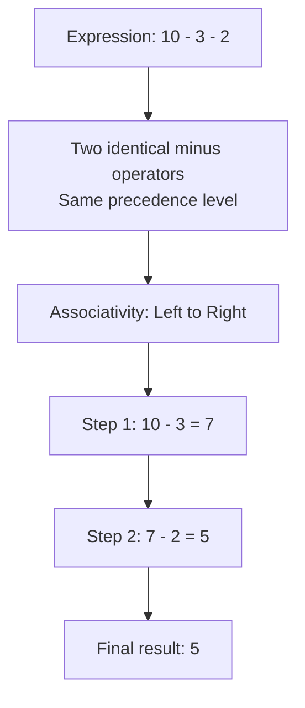
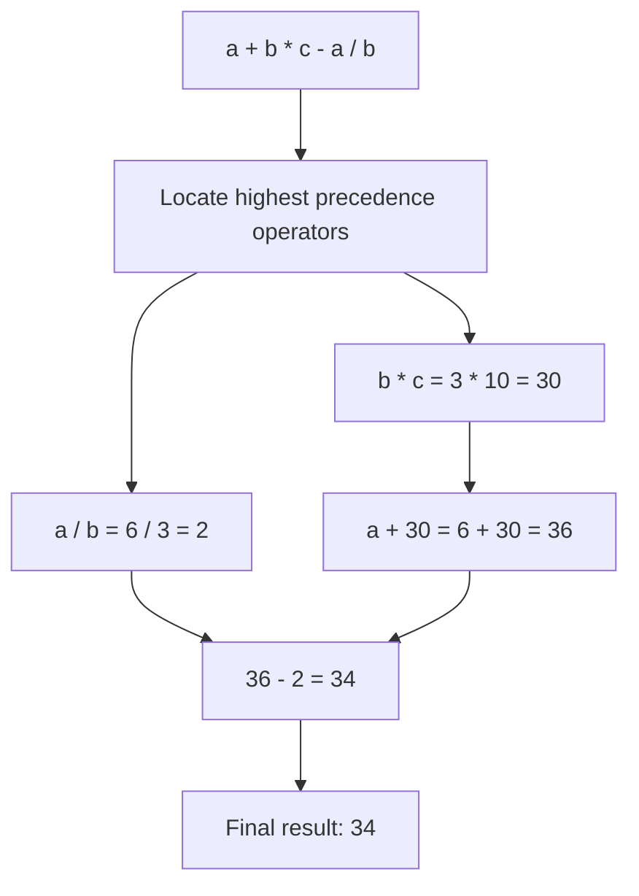
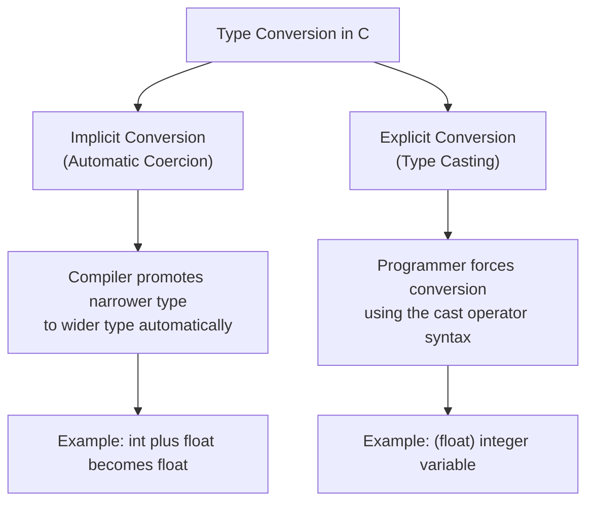
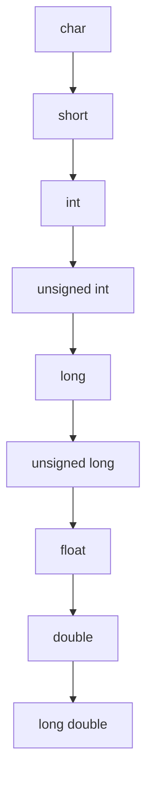
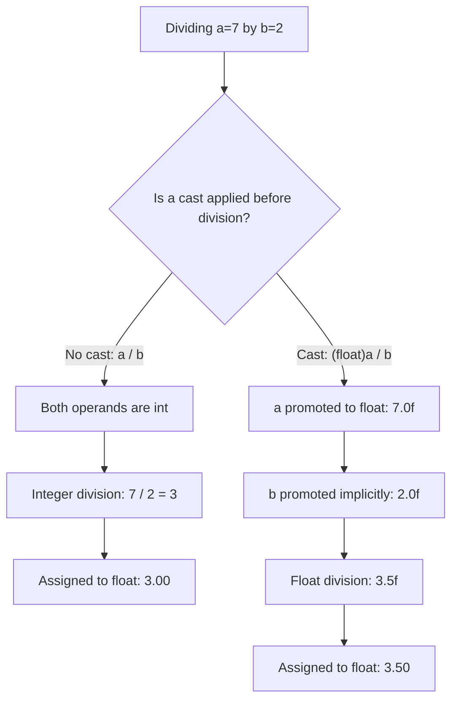

## tags: [c-programming, lecture] lecture: 8 topic: Operator Precedence, Associativity, and Type Conversion prerequisites: Lecture 7

# Lecture 8 — Operator Precedence, Associativity & Type Conversion

## Agenda

Three interconnected topics make up this lecture, each of which shapes how C reads and evaluates expressions:

- [[#^operator-precedence|Precedence]] and [[#^operator-associativity|associativity]] of operators
- Solving various expressions in code
- [[#^type-conversion|Type conversion]] — implicit and explicit forms

---

## Operator Precedence & Associativity

> [!warning] Live Demo — Check Video This section was a live demonstration and was not captured in the slides. Refer back to the lecture video for the walkthrough.

### What Is Operator Precedence?

**Operator precedence** determines which operator is evaluated first when an expression contains multiple operators. Just as standard mathematics evaluates multiplication before addition, C follows a well-defined hierarchy for every operator in the language. Without this hierarchy, expressions would be ambiguous and unpredictable.

Consider this expression:

```c
int result = 2 + 3 * 4;
```

Because `*` outranks `+` in the precedence table, C evaluates `3 * 4` first (yielding 12) and then adds 2. The result is **14**, not 20.

The table below lists common C operators ordered from highest precedence (level 1) to lowest (level 15):

|Level|Operators|Category|Associativity|
|---|---|---|---|
|1|`()` `[]` `->` `.`|Postfix / member access|Left to Right|
|2|`++` `--` `+` `-` `!` `~` `(type)` `*` `&` `sizeof`|Unary|Right to Left|
|3|`*` `/` `%`|Multiplicative|Left to Right|
|4|`+` `-`|Additive|Left to Right|
|5|`<<` `>>`|Bitwise shift|Left to Right|
|6|`<` `<=` `>` `>=`|Relational|Left to Right|
|7|`==` `!=`|Equality|Left to Right|
|8|`&`|Bitwise AND|Left to Right|
|9|`^`|Bitwise XOR|Left to Right|
|10|`\|`|Bitwise OR|Left to Right|
|11|`&&`|Logical AND|Left to Right|
|12|`\|`|Logical OR|Left to Right|
|13|`?:`|Ternary conditional|Right to Left|
|14|`=` `+=` `-=` `*=` `/=` `%=` `\|=` `^=` etc.|Assignment|Right to Left|
|15|`,`|Comma|Left to Right|

### What Is Operator Associativity?

**Operator associativity** resolves ties — it applies when two or more operators of _equal_ precedence compete in the same expression. It dictates whether evaluation proceeds left-to-right or right-to-left.

- **Left-to-right**: Most arithmetic and comparison operators associate this way. The expression `a - b - c` is computed as `(a - b) - c`.
- **Right-to-left**: Assignment and unary operators associate this way. The expression `a = b = 5` is processed as `a = (b = 5)` — `b` receives 5 first, then `a` receives that value.



> [!tip] Parentheses Always Win Parentheses sit at level 1 of the precedence table and override every other rule. Adding them wherever clarity is needed costs nothing and makes your intent unambiguous to both the compiler and any future reader of the code.

### Sample Program — Precedence and Associativity in Action

```c
#include <stdio.h>       // provides printf for console output

int main() {
    int a = 10, b = 4, c = 2;   // declare three integer variables

    // * has higher precedence than +
    int r1 = a + b * c;          // 10 + (4 * 2) = 18, NOT (10 + 4) * 2 = 28

    // - is left-associative: (a - b) - c
    int r2 = a - b - c;          // (10 - 4) - 2 = 4, NOT 10 - (4 - 2) = 8

    // assignment is right-associative: x = (y = 7)
    int x, y;
    x = y = 7;                   // y = 7 first; then x receives y's value

    printf("r1 = %d\n", r1);            // 18
    printf("r2 = %d\n", r2);            // 4
    printf("x = %d, y = %d\n", x, y);  // x = 7, y = 7

    return 0;   // signals successful execution to the operating system
}
```

|Line|Code|Explanation|
|---|---|---|
|1|`#include <stdio.h>`|Includes the standard I/O header; required for [[printf]]|
|4|`int a = 10, b = 4, c = 2;`|Three integers declared in a single statement using the comma operator|
|7|`int r1 = a + b * c;`|`*` has higher precedence than `+`, so `b * c` is evaluated first|
|10|`int r2 = a - b - c;`|`-` is left-associative; `(a - b)` is computed before subtracting `c`|
|12–13|`x = y = 7;`|Assignment is right-associative; `y = 7` executes first, then `x = y`|
|15–17|`printf(...)`|`%d` is the format specifier for printing integers|
|19|`return 0;`|Returns zero to tell the OS the program completed without error|

---

## Solving Various Expressions in Coding

> [!warning] Live Demo — Check Video This section was a live demonstration and was not captured in the slides. Refer back to the lecture video for the walkthrough.

Applying precedence and associativity to real expressions is a skill that develops with practice. The reliable approach is to scan the expression for the highest-precedence operators first, evaluate them, substitute the result in place, and repeat downward through the precedence hierarchy until a single value remains.

The program below exercises this process across several common expression patterns:

```c
#include <stdio.h>    // for printf

int main() {
    int a = 6, b = 3, c = 10;

    // * and / bind tighter than + and -; both are evaluated left-to-right
    int e1 = a + b * c - a / b;   // 6 + 30 - 2 = 34

    // relational operators run before &&; parentheses make intent clear
    int e2 = (a > b) && (c != b);  // (1) && (1) = 1  (true)

    // compound assignment: * is evaluated before +=
    int d = 5;
    d += a * b;   // d = d + (a * b) = 5 + 18 = 23

    // post-increment: current value of a is used in the expression, then a increases
    int e3 = a++ + b;   // 6 + 3 = 9; a becomes 7 after this statement

    printf("e1 = %d\n", e1);  // 34
    printf("e2 = %d\n", e2);  // 1
    printf("d  = %d\n", d);   // 23
    printf("e3 = %d\n", e3);  // 9
    printf("a  = %d\n", a);   // 7  (post-increment has taken effect)

    return 0;
}
```

|Line|Code|Explanation|
|---|---|---|
|7|`int e1 = a + b * c - a / b;`|`b * c` and `a / b` are resolved first (left-to-right among `*`/`/`); then `+` and `-` are applied|
|10|`int e2 = (a > b) && (c != b);`|Each parenthesised comparison yields 1 (true); `&&` then combines them|
|12–13|`d += a * b;`|`*` runs before `+=`; the product is added to `d`|
|15|`int e3 = a++ + b;`|[[#^post-increment|



> [!bug] Post-Increment vs Pre-Increment `a++` uses `a`'s current value first and increments afterward. `++a` increments first and uses the updated value. Mixing them up in compound expressions is one of the most common sources of subtle, hard-to-spot bugs in C.

---

## Understanding Type Conversion with Its Types

**Type conversion** is the process of transforming a value from one data type to another. C supports two categories: **implicit conversion**, performed automatically by the compiler, and explicit conversion, triggered manually by the programmer using the cast operator. Both forms appear constantly in real programs.



### Implicit Type Conversion

> [!warning] Live Demo — Check Video This section was a live demonstration and was not captured in the slides. Refer back to the lecture video for the walkthrough.

**Implicit type conversion** — also called _automatic type promotion_ or _coercion_ — takes place without any programmer action. When an arithmetic expression mixes two numeric types, C automatically promotes the narrower type to the wider type so no data is lost during the computation.

The [[#^promotion-hierarchy|promotion hierarchy]] runs from narrowest to widest:



> [!info] Promotion Is Always Upward The compiler promotes in one direction only — toward the wider type. When you add an [[int]] to a [[double]], the `int` is silently converted to `double` before the addition occurs. No fractional data is introduced or lost in an upward promotion.

```c
#include <stdio.h>   // for printf

int main() {
    int   i = 7;          // integer variable
    float f = 2.5f;       // float variable

    // i is automatically promoted to float before the addition: 7.0f + 2.5f
    float result = i + f;  // = 9.5f

    char  ch = 'A';        // char stores the ASCII code 65
    // ch is promoted to int automatically
    int   ascii_val = ch;  // = 65

    printf("result    = %.2f\n", result);    // 9.50
    printf("ascii_val = %d\n",   ascii_val); // 65

    return 0;
}
```

|Line|Code|Explanation|
|---|---|---|
|4–5|`int i = 7; float f = 2.5f;`|Two variables of different numeric types|
|8|`float result = i + f;`|`i` is promoted to `float` automatically; then `7.0f + 2.5f = 9.5f`|
|10–11|`int ascii_val = ch;`|[[char]] is widened to `int`; the stored value is the [[ASCII]] code 65|
|13–14|`printf(...)`|`%.2f` formats the float to two decimal places; `%d` for the integer|

> [!tip] Character Arithmetic Because `char` promotes to `int` implicitly, you can do arithmetic directly on character values. `'A' + 1` yields the integer 66, which corresponds to `'B'`. This is intentional by design in C.

### Explicit Type Conversion

> [!warning] Live Demo — Check Video This section was a live demonstration and was not captured in the slides. Refer back to the lecture video for the walkthrough.

[[#^type-casting|Type casting]] gives the programmer direct control over how a value is interpreted, by specifying the target type explicitly. The syntax is:

```c
(target_type) expression
```

Casting is necessary when implicit promotion alone cannot produce the desired result — for example, when floating-point division is required between two integer variables.

> [!danger] Casting Truncates — It Does Not Round Casting a [[float]] or `double` to `int` silently **drops every digit after the decimal point**. `(int)3.99` produces `3`, not `4`. Casting a wide integer type to a narrower one (such as `long` to `char`) risks overflow. Always verify the target type can safely hold the value being converted.

```c
#include <stdio.h>   // for printf

int main() {
    int a = 7, b = 2;

    // Without a cast: both operands are int, so integer division occurs first
    float bad  = a / b;           // 7 / 2 = 3 (truncated), then stored as 3.0f

    // With a cast: a becomes float BEFORE the division is performed
    float good = (float)a / b;    // 7.0f / 2 = 3.5f

    // Casting a float down to int — decimal is truncated, not rounded
    float pi = 3.14159f;
    int   truncated = (int)pi;    // = 3; the .14159 is discarded

    printf("bad       = %.2f\n", bad);        // 3.00 — precision lost
    printf("good      = %.2f\n", good);       // 3.50 — correct
    printf("truncated = %d\n",   truncated);  // 3

    return 0;
}
```

|Line|Code|Explanation|
|---|---|---|
|7|`float bad = a / b;`|Both are `int`; integer division yields 3; only then is 3 stored as `3.0f`|
|10|`float good = (float)a / b;`|Casting `a` promotes it to `float` first; `b` is then implicitly promoted; result is `3.5f`|
|13|`int truncated = (int)pi;`|The decimal part `.14159` is discarded; result is `3`|
|15–17|`printf(...)`|`%.2f` shows two decimal places for floats; `%d` for the integer|



> [!success] Cast the Operand — Not the Result Writing `(float)(a / b)` applies the cast _after_ integer division has already occurred — you still get `3.0`, not `3.5`. To get the correct result, cast _before_ the division: `(float)a / b` forces float arithmetic from the start.

### Program — Type Conversion Comparison

> [!warning] Live Demo — Check Video This section was a live demonstration and was not captured in the slides. Refer back to the lecture video for the walkthrough.

The following program places implicit and explicit conversion side-by-side so their differences are immediately visible in the output:

```c
#include <stdio.h>   // for printf

int main() {
    // --- Implicit conversion ---
    int    x = 10;
    double d = 3.7;
    // x is automatically promoted to double: 10.0 + 3.7 = 13.7
    double implicit_res = x + d;

    // --- Explicit conversion ---
    double y = 9.99;
    // (int) cast truncates — .99 is silently discarded
    int    explicit_res = (int)y;   // = 9

    // --- Casting to fix integer division ---
    int p = 5, q = 2;
    // Without the cast, 5 / 2 would yield 2 (integer division)
    float  div_result = (float)p / q;  // 5.0f / 2 = 2.5f

    printf("Implicit:  10 + 3.7  = %.2f\n", implicit_res);  // 13.70
    printf("Explicit:  (int)9.99 = %d\n",   explicit_res);   // 9
    printf("Cast div:  5 / 2     = %.2f\n", div_result);     // 2.50

    return 0;
}
```

|Line|Code|Explanation|
|---|---|---|
|8|`double implicit_res = x + d;`|`x` (int) is automatically widened to `double` before the addition|
|12|`int explicit_res = (int)y;`|`(int)` cast drops the `.99`; result is `9` — no rounding|
|16|`float div_result = (float)p / q;`|Casting `p` before division avoids [[#^integer-division|
|19–21|`printf(...)`|`%.2f` for floating-point values; `%d` for the integer result|

> [!question] What Happens at the Boundaries? What would `(int)-3.7` produce? What about `(char)300`? Exploring edge cases — negative numbers, overflow, boundary values — deepens your intuition for how type conversion behaves in practice. Try a few in a small test program.

---

## Key Terms

|Term|Definition|
|---|---|
|Operator Precedence|The language rule that determines which operator is evaluated first in an expression containing operators of different types|
|Operator Associativity|The language rule that determines evaluation order (left-to-right or right-to-left) when two or more operators of the same precedence appear in the same expression|
|Type Conversion|The process of transforming a value from one data type to another, either automatically by the compiler or deliberately by the programmer|
|Implicit Type Conversion|Automatic type promotion performed by the C compiler when an expression mixes operands of different numeric types; narrower types are always widened to the broader type|
|Explicit Type Conversion|Programmer-controlled type conversion using the cast operator `(type)`; forces a specific type interpretation of the given value|
|Type Casting|Synonym for explicit type conversion; uses the syntax `(target_type) expression` to override the natural type of a value|
|Integer Division|Division between two integer operands where the fractional part of the result is discarded (truncated), not rounded|
|Promotion Hierarchy|The ordered chain of numeric types from narrowest (`char`) to widest (`long double`) that governs which direction implicit type promotion travels|
|Post-increment|The unary `++` operator placed after a variable; the variable's current value is used in the expression and the increment is applied only after the expression is fully evaluated|
|Truncation|The removal of the fractional component when a floating-point value is converted to or stored in an integer type; no rounding occurs|

> [!example]- Try It Yourself **Exercise 1 — Trace Expression Evaluation** Before compiling, apply the precedence table manually to predict what each line prints. Write your answers, then run the code to verify.
> 
> ```c
> int a = 8, b = 3, c = 2;
> printf("%d\n", a + b * c);
> printf("%d\n", a / b + c);
> printf("%d\n", a - b - c);
> ```
> 
> **Exercise 2 — Fix the Precision Bug** The code below should print `2.50` but prints `2.00`. Add a single cast in exactly the right place to fix it without changing any declared values.
> 
> ```c
> int   x = 5, y = 2;
> float result = x / y;
> printf("%.2f\n", result);
> ```
> 
> **Exercise 3 — Observe Implicit Promotion** Declare a `char` variable and assign it the letter `'M'`. Then assign it to an `int` variable and print both using `%c` (character form) and `%d` (integer form). Confirm that the integer version holds the value 77 — the ASCII code for `'M'` — and that the `char` version still prints the letter itself.

---

**Lecture 8 Recap**

- Operator precedence defines a strict evaluation hierarchy; higher-precedence operators bind their operands before lower-precedence ones get a chance — multiplication and division always run before addition and subtraction.
- Operator associativity breaks ties between equal-precedence operators; most arithmetic operators are left-to-right, while assignment is right-to-left.
- Parentheses sit at the top of the precedence table and override all other rules; use them freely in complex expressions to guarantee correctness and readability.
- Implicit type conversion automatically promotes narrower types to wider ones when operands of different types are mixed; no data is lost in an upward promotion.
- Explicit type conversion (casting) forces a specific type; casting a floating-point value to integer truncates the decimal — it does not round.
- A pervasive bug: dividing two integers and expecting a decimal result. At least one operand must be cast to `float` or `double` _before_ the division to avoid integer truncation.